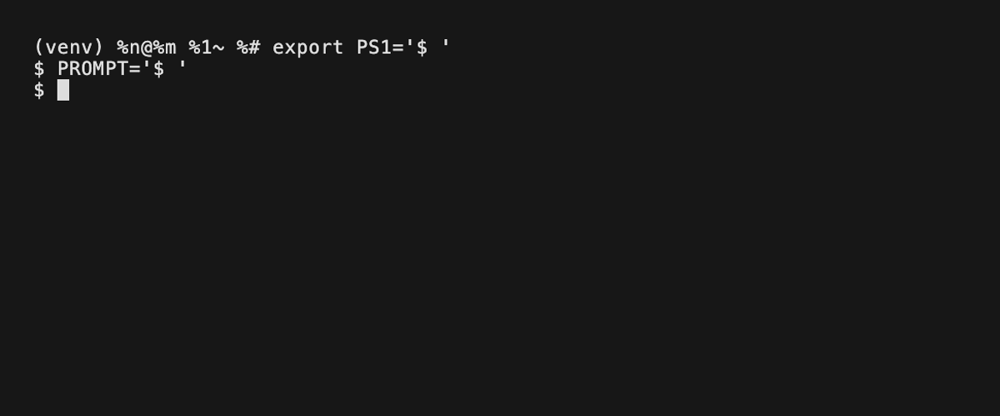

# OMS - Order Management System

### Статус проекта: даже не MVP:<


 
 
 
 

### Установка зависимостей <3



## 📂 Структура проекта

```python
OMS/
├── api/
│   ├── dto/
│   │   ├── schema/
│   │   │   ├── order.py
│   │   │   ├── orderItem.py
│   │   │   ├── product.py
│   │   │   └── user.py
│   │   ├── __init__.py
│   │   └── dependency.py
│   └── __init__.py
├── repository/
│   ├── model/
│   │   ├── dependency.py
│   │   ├── order.py
│   │   ├── orderItem.py
│   │   ├── product.py
│   │   └── user.py
│   ├── repo/
│   │   └── user.py
│   └── __init__.py
├── service/
│   └── __init__.py
├── .env
├── .gitignore
├── config.py
├── core.py
├── exception.py
├── README.md
└── requirements.txt

```
